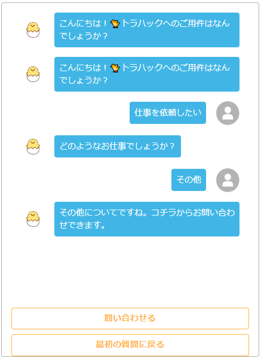
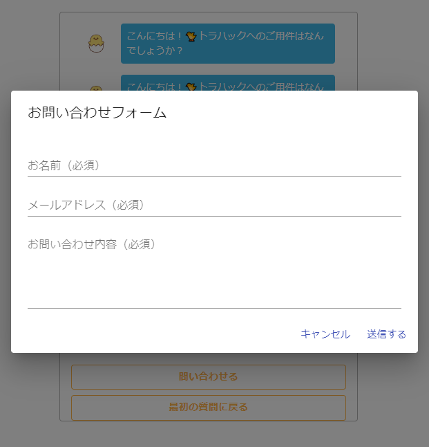

<!-- PROJECT LOGO -->
 

  
 
# React
React practice <a href="https://github.com/deatiger/chatbot-demo">@deatiger</a>

## 01. Table of Contents
- [Code](#code)
- [Demo](#demo)
- [Requirements](#requirements)
  
## 02. Code
### Create react app
  `yarn create react-app [PROJECT NAME]`
### Material-UI
`yarn add @material-ui/core @material-ui/system`
`yarn add @material-ui/icons --network-timeout 500000`
 
⚠ `npm install`では動かないので`yarn`を使う 
⚠ `--network-timeout 500000`: timeout error回避のため

## 03. Demo
### Demo.1 chat

### Demo.2 form

  
## 04. Requirements
  
 packages in environment: 
| Name |  Version | Memo |
| :---: |  :---:  |  :---:  |
| @Material-ui | v4.0 | 現在は@muiに名称が変わった |
